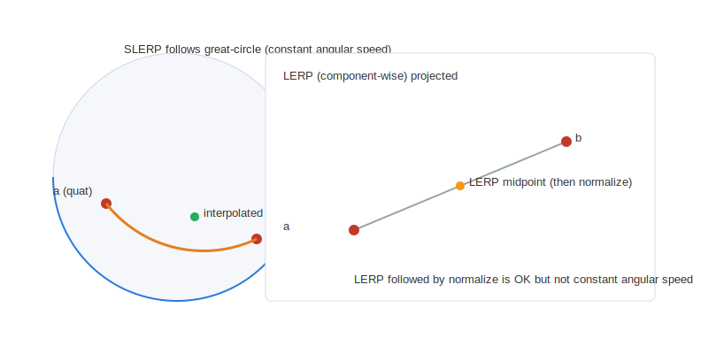
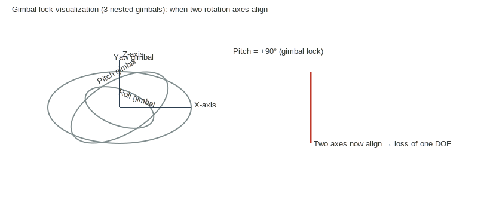

# Transformers — Theory and Practical Guide

This document is a beginner-to-advanced guide explaining 3D coordinate transforms
used in ADAS sensor processing. It covers Euler angles, their limitations
(including gimbal lock), quaternions, SLERP vs LERP, and practical numerical
examples. By the end you'll understand when to use Euler rotations, when to
prefer quaternions, how to perform conversions, and how to use the AdasTools
`transformers` and `quaternion` utilities.

This guide is structured as follows:

1. What is a coordinate transform?
2. Euler angles (roll, pitch, yaw)
   - Definitions
   - How to rotate a vector using Euler angles (matrices)
   - Weaknesses (gimbal lock, interpolation issues)
3. Quaternions
   - Definition and relation to rotations
   - Quaternion math: multiply, normalize, rotate vector
   - Advantages over Euler angles
4. Interpolation between orientations
   - LERP (linear interpolation)
   - SLERP (spherical linear interpolation)
   - LERP fallback when quaternions are nearly aligned
5. Practical differences vs simple scaling/translating coordinates
   - Numerical example and stepwise walkthrough
6. Using the AdasTools API (small code examples)
7. Advanced notes and references

---

## 1) What is a coordinate transform?

A coordinate transform converts the coordinates of a point expressed in one
frame (local/sensor) into another frame (vehicle/global or another sensor’s
frame). A transform typically combines rotation and translation:

```
p_global = R * p_local + t
```

Where `R` is a 3x3 rotation matrix and `t` is a translation vector (origin of
local frame in global coordinates).

Rotation can be expressed in different representations:
- Euler angles (roll, pitch, yaw), converted into a rotation matrix
- Quaternions, compact 4D representation of rotation
- Rotation matrices directly

Each representation has trade-offs we explore below.

---

## 2) Euler angles (roll, pitch, yaw)

### Definition

Euler angles describe a rotation by three sequential elemental rotations about
principal axes. A common convention in vehicle/sensor contexts is:
- roll (φ): rotation about X-axis
- pitch (θ): rotation about Y-axis
- yaw (ψ): rotation about Z-axis

We often use the intrinsic rotation sequence R = Rz(ψ) * Ry(θ) * Rx(φ)
(rotate by roll about local X, then by pitch about new Y, then yaw about new Z
or the equivalent intrinsic/extrinsic convention depending on how you define
frames). The `AdasTools` implementation uses this sequence for consistency.

### Rotation matrices

Elemental rotation matrices are:

Rx(φ) =
[ 1    0       0
  0  cosφ  -sinφ
  0  sinφ   cosφ ]

Ry(θ) =
[ cosθ   0  sinθ
   0     1   0
 -sinθ   0  cosθ ]

Rz(ψ) =
[ cosψ -sinψ  0
  sinψ  cosψ  0
   0     0    1 ]

Combined (R = Rz * Ry * Rx) yields a full 3x3 rotation matrix which you can
apply to any vector `p_local` to get `p_global`.

### Weaknesses of Euler angles

- Gimbal lock: at certain angles (e.g., pitch = ±90°) two rotation axes become
  aligned and the system loses one degree of freedom — you cannot uniquely
  represent small rotations around some axes.
- Interpolation problems: interpolating Euler angles component-wise can produce
  non-constant angular velocities and unnatural paths.
- Composition cost/complexity: composing multiple rotations requires converting
  to matrices or quaternions.

Gimbal lock is illustrated later in the gimbal test. While Euler angles are
simple to think about and easy to parameterize, they are not robust for
interpolation or sequences of rotations.

---

## 3) Quaternions

### What is a quaternion?

A quaternion is a 4D number used to represent rotations compactly. A unit
quaternion q = w + xi + yj + zk encodes a rotation when normalized (||q|| = 1).

Conversion from axis-angle (unit axis u, angle α) to quaternion:

q = [cos(α/2), u_x sin(α/2), u_y sin(α/2), u_z sin(α/2)]

Conversion from Euler (roll, pitch, yaw) to quaternion is commonly used and is
implemented in this project.

### Quaternion math (basic operations)

- Multiplication: q = q1 * q2 composes rotations (apply q2 then q1).
- Normalization: keep quaternions unit length to represent only rotation.
- Rotate vector: convert quaternion to rotation matrix (or use quaternion
  sandwich: p' = q * p * q^{-1} treated with quaternion-vector multiplication).

Quaternions avoid gimbal lock and are numerically stable for composing many
rotations. They are compact (4 numbers) compared to a 3x3 matrix (9 numbers).

---

## 4) Interpolation between orientations

When you need to smoothly move an orientation from `a` to `b`, interpolation is
required. Two common choices:

### LERP (Linear interpolation)

LERP between quaternions is simply component-wise linear interpolation:

q(t) = (1-t) * a + t * b

However LERP does not keep the result on the unit-sphere in 4D — you need to
normalize after LERP. LERP also does not produce constant-speed angular
motion; it is not geometrically correct on the rotation manifold (S^3).

### SLERP (Spherical Linear intERPolation)

SLERP rotates along the great circle on the 4D unit sphere between `a` and `b`:

q(t) = (sin((1-t)ω) / sin ω) * a + (sin(t ω) / sin ω) * b

where ω = arccos(dot(a,b)). SLERP produces constant angular velocity between
a and b and stays on the unit sphere without extra normalization.

#### LERP fallback

When quaternions are nearly identical (ω small), SLERP's denominator sin ω can
be numerically unstable. In that case LERP followed by normalization is used as
a fallback — the two produce nearly identical results but LERP is cheaper.

The implementation uses the sign of dot(a,b) to ensure shortest-path
interpolation (if dot < 0, negate one quaternion before interpolation).

---

## 5) Practical differences vs simple scaling/translating coordinates

Scaling/translating a coordinate is linear and trivial:

p_scaled = s * p
p_translated = p + t

Rotation is non-linear when applied in 3D (though represented linearly via a
matrix). Using Euler angles to rotate is fine for single-step transforms. But
when you want to compose many rotations, interpolate orientations, or avoid
singularities, quaternions are preferred.

### Numerical example: stepwise walkthrough

Consider a local sensor point p_local = (1.0, 0.5, 0.2)
Sensor frame origin o = (2.0, 0.1, 0.5)
Sensor frame orientation roll=0, pitch=0, yaw=45° (0.785398 rad)

1) Matrix approach:
   - Build Rx(0), Ry(0), Rz(0.785398)
   - R = Rz * Ry * Rx = Rz(0.785398)
   - p_rot = R * p_local
   - p_global = p_rot + o

   Numerically:
   Rz(45°) = [[0.7071, -0.7071, 0], [0.7071, 0.7071, 0], [0,0,1]]
   p_rot = [1*0.7071 - 0.5*0.7071, 1*0.7071 + 0.5*0.7071, 0.2] = [0.35355, 1.06066, 0.2]
   p_global = [2.0 + 0.35355, 0.1 + 1.06066, 0.5 + 0.2] = [2.35355, 1.16066, 0.7]

2) Quaternion approach:
   - q = quaternionFromRPY(0,0,0.785398)
   - p_rot = rotateByQuaternion(q, p_local)
   - p_global = p_rot + o

   The output matches the matrix approach (see the example program output).

3) Interpolation example (why quaternions):
   - Suppose you need to smoothly rotate sensor orientation from yaw=0 to yaw=90°.
   - Interpolating yaw angles linearly works but interpolating the full
     orientation via SLERP provides constant angular velocity and works equally
     well when roll/pitch are non-zero.

---

## 6) Using the AdasTools API (quick reference)

The root `README.md` contains a short reference to the most important
functions and example targets. This document focuses on the mathematical
background, numerical examples, and visualizations. For quick API usage see
`README.md` at the repository root; the rest of this guide shows why and when
to choose each representation and how to implement transforms robustly.

---

## 7) Advanced notes and references

- Quaternions and rotation matrices are isomorphic representations (unit
  quaternion <-> rotation matrix). Use quaternions for interpolation and
  stable composition.
- When mixing many small rotations (e.g., integrating angular velocity), use
  quaternions or rotation matrices with re-normalization steps to avoid drift.
- For integration of angular rates (gyros), consider using quaternion
  integration via exponential map or small-angle approximations; Euler
  integration suffers from coordinate singularities.

References and reading
- "Quaternions and Rotation Sequences" — J. B. Kuipers
- "Representing Attitude: Euler Angles, Unit Quaternions, and Rotation Vectors" — a short tutorial
- Wikipedia: Quaternion, SLERP, Gimbal Lock

---

## Visualizations

Below are two illustrations that help explain the difference between SLERP and LERP
interpolation (left) and the gimbal-lock condition where two rotation axes align
(right). The images are stored in `Documentation/Transformers/images/` and are
included here with relative paths so they render in the repository.

<div style="display:flex; gap:24px; align-items:flex-start;">
  <figure style="margin:0">
    
    <figcaption class="label">SLERP vs LERP (constant angular velocity vs linear projection)</figcaption>
  </figure>

  <figure style="margin:0">
    
    <figcaption class="label">Gimbal lock: pitch = ±90° causes axis alignment and loss of one degree of freedom</figcaption>
  </figure>
</div>
